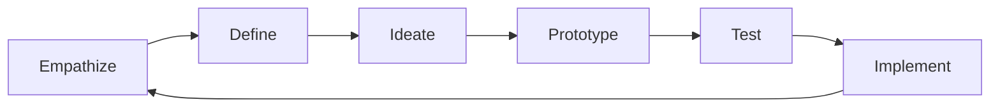

# Innovation Methodologies

## Overview

Successful innovation requires both creativity and structure. Over the years, I've mastered and adapted various methodologies to drive consistent innovation outcomes. Each framework offers unique strengths for different types of challenges and contexts.

## Design Thinking

### Process Overview


### Key Principles
- **Human-Centered**: Start with user needs
- **Iterative**: Continuous refinement
- **Collaborative**: Diverse team input
- **Experimental**: Learning by doing

## Lean Startup

### Core Concepts
- **Minimum Viable Product (MVP)**: Smallest testable version
- **Build-Measure-Learn**: Rapid iteration cycle
- **Pivot or Persevere**: Data-driven decisions
- **Validated Learning**: Evidence-based progress

### Implementation Framework
```
Hypothesis → MVP → Metrics → Learning → Iteration
```

## Blue Ocean Strategy

### Strategy Canvas
```
High Price | Traditional | Blue Ocean
Features   |    High    |    Medium
Convenience|    Low     |    High
Speed      |  Medium    |    High
Cost       |    High    |    Low
```

### Four Actions Framework
- **Eliminate**: Remove industry standards
- **Reduce**: Factors below industry standard
- **Raise**: Factors above industry standard
- **Create**: New value factors

## Six Thinking Hats

### Hat Roles
- **White Hat**: Facts and data
- **Red Hat**: Emotions and feelings
- **Black Hat**: Caution and risks
- **Yellow Hat**: Benefits and optimism
- **Green Hat**: Creativity and alternatives
- **Blue Hat**: Process and control

## Future Methodologies

### Emerging Approaches
- **AI-Augmented Innovation**: Machine learning for idea generation
- **Circular Innovation**: Sustainable design principles

### Continuous Learning
- **Methodology Evolution**: Adapting frameworks
- **Customization**: Tailoring to context
- **Integration**: Combining best practices
- **Measurement**: Refining effectiveness metrics
