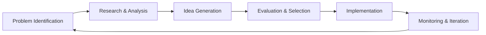

# Creative Problem Solving

## Overview

Complex problems require creative solutions that go beyond conventional thinking. My problem-solving approach combines analytical rigor with creative exploration to develop innovative solutions that address root causes and create lasting value.

## Problem-Solving Framework

### 6-Step Process

###
### Step 1: Problem Identification
- **Symptom Recognition**: Observable issues
- **Root Cause Analysis**: 5 Whys technique
- **Problem Framing**: Clear definition
- **Scope Definition**: Boundaries and constraints

###
### Step 2: Research & Analysis
- **Data Collection**: Quantitative and qualitative
- **Stakeholder Analysis**: Understanding perspectives

###
### Step 3: Idea Generation
- **Divergent Thinking**: Quantity over quality initially
- **Cross-Pollination**: Ideas from different domains
- **Analogical Thinking**: Solutions from similar problems
- **Constraint Removal**: "What if" scenarios

###
### Step 4: Evaluation & Selection
- **Feasibility Assessment**: Technical and resource evaluation
- **Impact Analysis**: Potential benefits measurement
- **Risk Assessment**: Potential downsides identification
- **Prioritization**: Ranking based on criteria

###
### Step 5: Implementation
- **Solution Design**: Detailed planning
- **Resource Allocation**: Budget and team assignment
- **Execution**: Project management
- **Change Management**: Stakeholder buy-in

###
### Step 6: Monitoring & Iteration
- **Feedback Collection**: User and stakeholder input
- **Adjustment**: Course corrections
- **Learning**: Documentation and sharing

##
## Creative Thinking Techniques

### Mind Mapping
**Purpose**: Visual exploration of ideas and connections

**Process**:
1. Start with central problem/topic
2. Branch out with main categories
3. Add sub-branches with details
4. Look for patterns and connections

##
## Future of Problem Solving

###
### Emerging Approaches
- **AI-Assisted Problem Solving**: Machine learning for pattern recognition
- **Systems Thinking**: Holistic perspective
- **Computational Thinking**: Algorithmic approach
- **Design Thinking**: Human-centered approach
- **Critical Thinking**: Logical analysis
