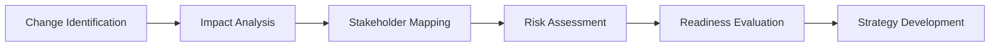

# Change Management

## Overview

There is always changes in today's business environment. Effective change management requires a good balance of strategic vision, empathetic leadership, and tactical execution. My approach focuses on minimizing disruption while maximizing adoption and benefit realization.

##
## Change Management

### 1. Assessment Phase


### 2. Planning Phase
- **Communication Strategy**: Clear, consistent messaging
- **Training Plan**: Skill development and support
- **Implementation Timeline**: Phased rollout approach
- **Success Metrics**: Measurement and evaluation criteria

###
### 3. Execution Phase
- **Leadership Alignment**: Unified front from management
- **Team Engagement**: Active participation and feedback
- **Support Systems**: Resources and assistance

###
### 4. Reinforcement Phase
- **Success Celebration**: Acknowledging achievements
- **Feedback Integration**: Continuous improvement
- **Cultural Integration**: Embedding new behaviors
- **Sustainability Planning**: Long-term maintenance

##
## Resistance Management

### Common Sources of Resistance
- **Fear of Unknown**: Uncertainty about future
- **Loss of Control**: Reduced autonomy
- **Skill Gaps**: Inadequate capabilities
- **Habit Breaking**: Comfort with status quo
- **Trust Issues**: Lack of confidence in leadership

###
### Mitigation Strategies
```
Identify Resistance → Understand Concerns → 
Address Issues → Provide Support → 
Monitor Progress → Adjust Approach
```

### Engagement Techniques
- **Early Involvement**: Participate in planning
- **Feedback Mechanisms**: Voice concerns
- **Champion Programs**: Peer support
- **Success Stories**: Share positive examples

##
## Leadership Role in Change

### Essential Leadership Behaviors
- **Vision Communication**: Inspiring and clear direction
- **Role Modeling**: Demonstrating commitment
- **Active Listening**: Understanding concerns
- **Decision Making**: Timely and confident choices
- **Resilience**: Maintaining momentum

###
### Leadership Actions
- **Champion Change**: Visible support and advocacy
- **Remove Barriers**: Address obstacles and blockers
- **Provide Resources**: Ensure necessary support
- **Celebrate Success**: Recognize achievements

##
## Best Practices Summary

### Keys
- Communicate early and often
- Involve stakeholders in planning
- Provide adequate training and support
- Celebrate milestones and successes
- Monitor progress and adjust
