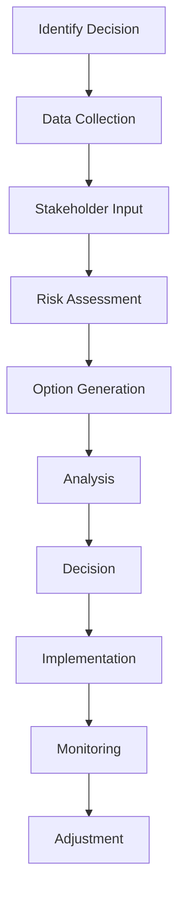

# Strategic Decisions

## Overview

Strategic decision-making requires balancing vision with data, intuition, and balancing short-term needs with long-term goals. My approach combines analysis with creative problem-solving to resolve complex business challenges.

## Decision-Making Framework

### 1. Information Gathering

### 2. Analysis Methods
- **Quantitative Analysis**: Financial modeling with budget and cost, ROI calculations
- **Risk Analysis**: Probability and impact assessment

### 3. Decision Criteria
- **Strategic Alignment**: Consistency with vision and goals
- **Resource Requirements**: Time, money, people alignment
- **Risk Tolerance**: Acceptable risk levels, Company image, Team's morale
- **Stakeholder Impact**: Effect on all parties

## Communication Strategy

### Stakeholder Management
- **Management**: Regular updates, quarterly reviews
- **Clients**: Team meetings, writen communications
- **Partners**: Regular check-ins, strategic alignment

### Transparency
- **Decision Rationale**: Clear explanation of why
- **Data Sharing**: Relevant information access
- **Progress Updates**: Regular status communications

## Future Strategic Focus

### Emerging Opportunities
- **AI Integration**: Automation and intelligence
- **Digital Transformation**: Technology adoption

### Personal Development
- **Strategic Thinking**: Big-picture perspective
- **Industry Knowledge**: Continuous learning
- **Network Building**: Relationship cultivation
- **Mentorship**: Learning from others