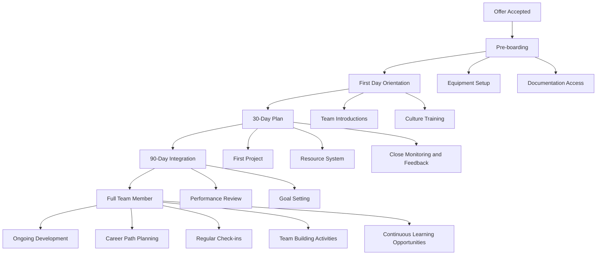

# Team Management

## Overview

Effective team management is critical for the success of organizational. My approach focuses on creating environments my teammates can collaborate effectively to achieve results together.


## 
## Team Building Strategies

### 1. Talent Acquisition
- **Strategic Hiring**: Aligning team composition with business goals
- **Cultural Fit**: Ensuring alignment with organizational values
- **Skill Assessment**: Comprehensive evaluation of technical and soft skills
- **Peronality Assessment**: Make sure the personality matches team's need

### 2. Onboarding Excellence


### 3. Team Structure Optimization
- **Role Clarity**: Defined responsibilities and expectations
- **Communication Channels**: Efficient information flow
- **Decision Making**: Clear authority and processes


## 
## Performance Management

### Goal Setting Framework
- **SMART Goals**: Specific, Measurable, Achievable, Relevant, Time-bound
- **Individual Development Plans**: Personal growth objectives

### Regular Check-ins
```
Weekly: 1:1 meetings (30 minutes)
- Progress review
- Blocker identification
- Resource needs
- Feedback exchange

Monthly: Team meetings (60 minutes)
- Goal progress
- Team updates
- Recognition and celebration

Bi-yearly: Performance reviews (60 minutes)
- Achievement assessment
- Skill development
- Career planning
```

### Feedback Culture
- **Continuous Feedback**: Real-time recognition and improvement
- **360-Degree Reviews**: Comprehensive perspective gathering
- **Constructive Approach**: Focus on growth and development
- **Actionable Insights**: Clear improvement pathways


## 
## Team Development

### Skill Building Programs
- **Technical Training**: Latest technologies and best practices
- **Soft Skills**: Communication, leadership, collaboration
- **Cross-Training**: Multi-skill development
- **Certification Support**: Professional development investment

### Knowledge Sharing
- **Brown Bag Sessions**: Regular learning presentations
- **Documentation**: Comprehensive knowledge base

## 
## Conflict Resolution

### Proactive Measures
- **Clear Expectations**: Defined roles and responsibilities
- **Regular Communication**: Open dialogue channels
- **Team Building**: Relationship strengthening activities
- **Early Intervention**: Addressing issues before escalation

### Resolution Process
1. **Private Discussion**: Understanding individual perspectives
2. **Mediation**: Facilitated conversation between parties
3. **Solution Identification**: Collaborative problem-solving
4. **Agreement**: Clear action items and follow-up
5. **Monitoring**: Ensuring resolution effectiveness


##
## Lessons Learned

### What Works
- Regular, transparent communication
- Empowering team autonomy
- Investing in development
- Celebrating successes

### What to Avoid
- Micromanagement
- Inconsistent expectations
- Neglecting feedback
- Resistance to change


##
## Future Focus

### Emerging Trends
- **AI-Augmented Teams**: Leveraging AI for productivity
- **Skills-Based Hiring**: Focus on capabilities over credentials
- **Continuous Learning**: Lifelong development culture

### Development Areas
- **Emotional Intelligence**: Enhanced people skills
- **Digital Leadership**: Managing remote/hybrid teams